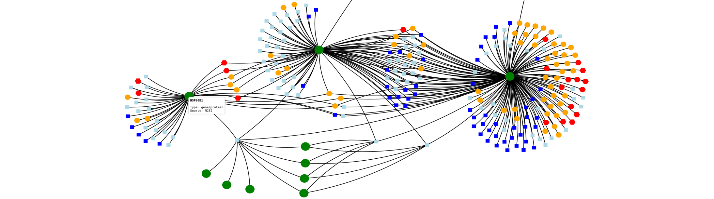
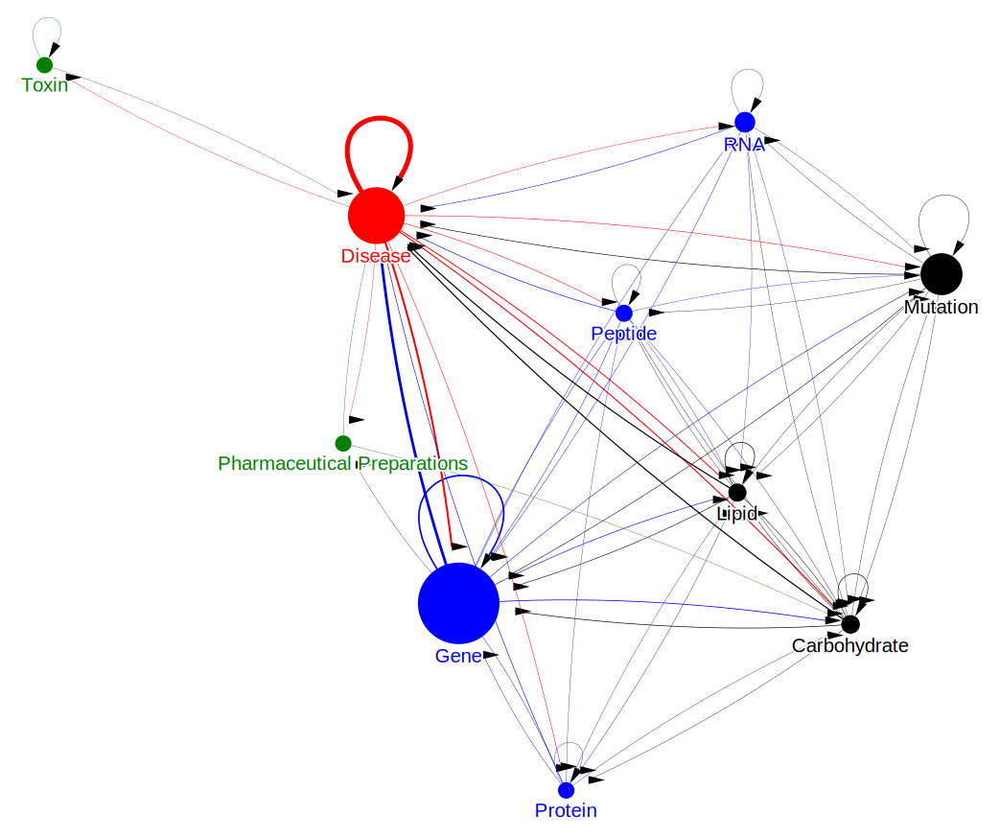
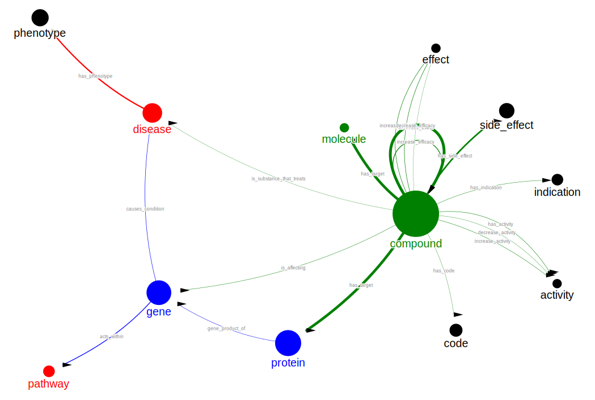
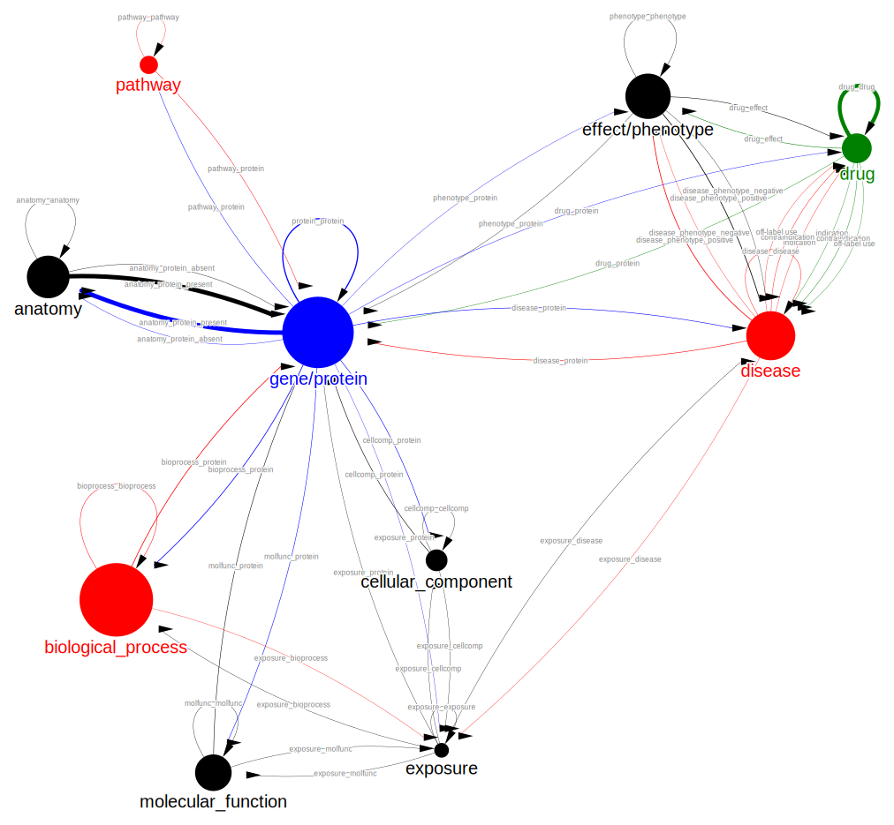
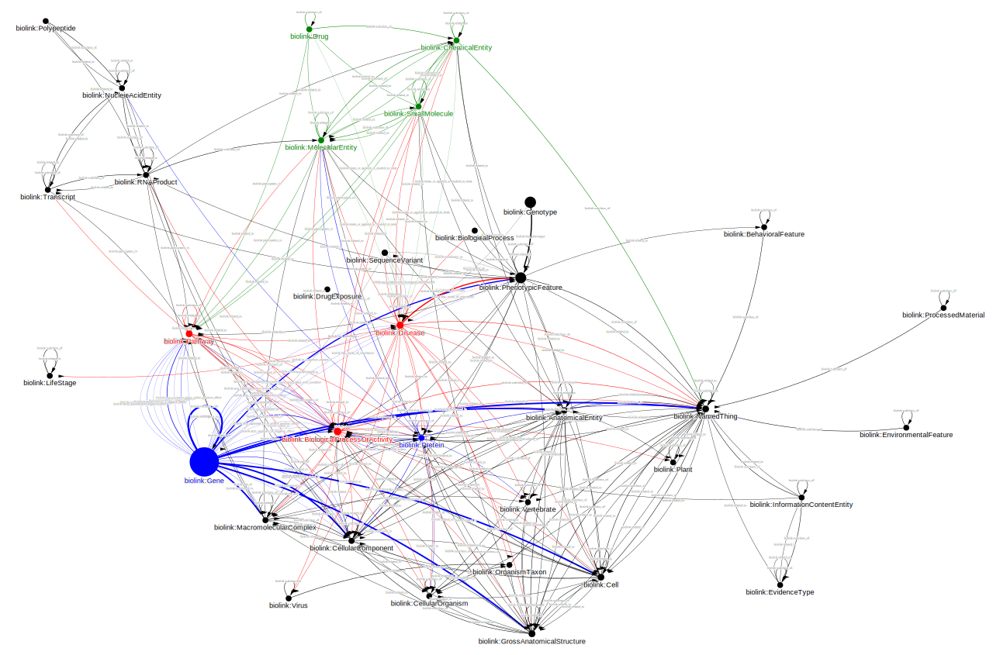
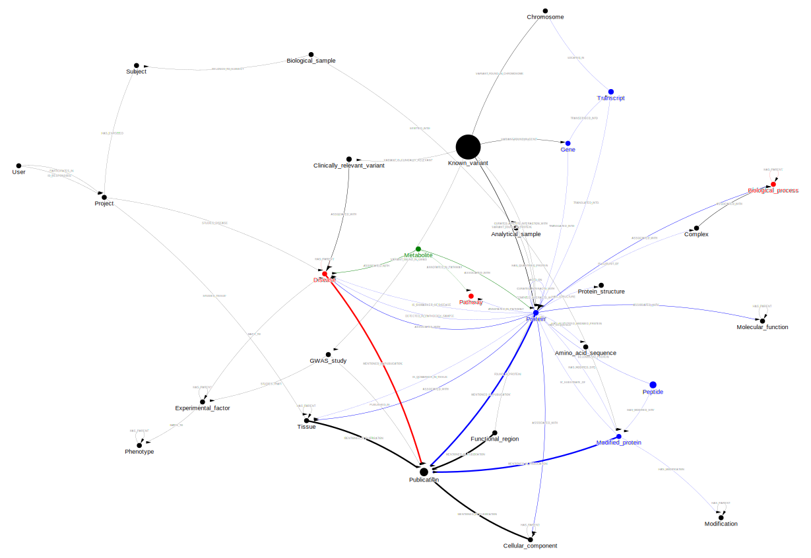

# Awesome biomedical knowledge graphs 

> A curated list of biomedical knowledge graphs and of resources for their construction.

This repository is inspired by [awesome lists](https://github.com/sindresorhus/awesome) and follows the style guide of the [awesome manifesto](https://github.com/sindresorhus/awesome/blob/main/awesome.md).

## Table of Contents

- [Introduction](#introduction)
- [Survey](#survey)
- [Curation](#curation)
- [Notebooks](#notebooks)

## Introduction

The goal of this repository is to provide an overview of [knowledge graphs](https://en.wikipedia.org/wiki/Knowledge_graph) in the domain of [biomedicine](https://en.wikipedia.org/wiki/Biomedicine) and of resources for their construction. This is achieved in three complementary ways:

1. A survey presents a broad overview of academic and commercial projects that provide biomedical knowledge graphs or associated resources.
2. A curated list contains an opinionated selection of some of these projects that I find worth highlighting for various reasons.
3. A collection of notebooks delivers an in-depth inspection of a handful of projects by performing an exploratory data analysis on their knowledge graphs.

I hope this work serves you well! If you have a suggestion, notice an error, or just want to drop a message, please don't hesitate to [contact me](mailto:roberthaas@protonmail.com). Direct contributions via a [pull request](https://docs.github.com/en/pull-requests) are also highly welcome.

## Survey

A [PDF report](target/bmkg.pdf) and accompanying [website](https://robert-haas.github.io/awesome-biomedical-knowledge-graphs) present a comprehensive overview of available biomedical knowledge graphs and of resources for their construction.

## Curation

A [curated list](curation.md) presents and characterizes a carefully selected subset of the survey's entries in the style of an [awesome list](https://github.com/sindresorhus/awesome).

## Notebooks

The following Jupyter notebooks inspect five projects in detail.

### Human Aging and Longevity Dataset (HALD)

[Notebook](https://robert-haas.github.io/awesome-biomedical-knowledge-graphs/notebooks/hald.html)

### Oregano

[Notebook](https://robert-haas.github.io/awesome-biomedical-knowledge-graphs/notebooks/oregano.html)

### Precision Medicine Knowledge Graph (PrimeKG)

[Notebook](https://robert-haas.github.io/awesome-biomedical-knowledge-graphs/notebooks/primekg.html)

### Monarch

[Notebook](https://robert-haas.github.io/awesome-biomedical-knowledge-graphs/notebooks/monarch.html)

### Clinical Knowledge Graph (CKG)

[Notebook](https://robert-haas.github.io/awesome-biomedical-knowledge-graphs/notebooks/ckg.html)

